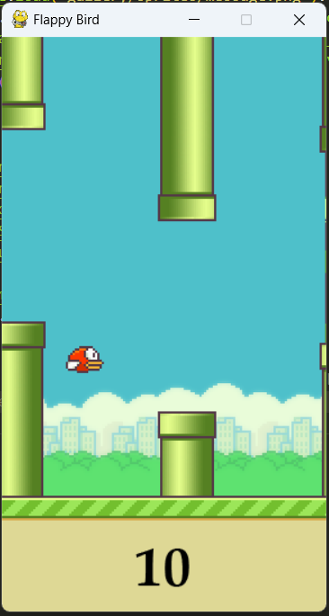

# Flappy-Bird
A simple Flappy Bird game made with Python and Pygame.  

## Requirements for this project are:
+ Python 3.10 and above
+ Pygame library for graphics and controls

## Pygame Installation
    pip install pygame

> If you get installation errors, make sure you first upgrade your wheel version using :  
`pip install --upgrade wheel`
> Pyttsx3 library depends on win32 for which we may get an error while executing the program. To avoid that simply install pypiwin32 in your environment.
` pip install pypiwin32 `
> If you are using a virtual environment, make sure to install the library in the virtual environment.

## **Full documentation of the Library**
### Pygame
    https://pygame.readthedocs.io/en/latest/1_intro/intro.html

## Game Description
 
 
Start screen
 
 

 
Gameplay
